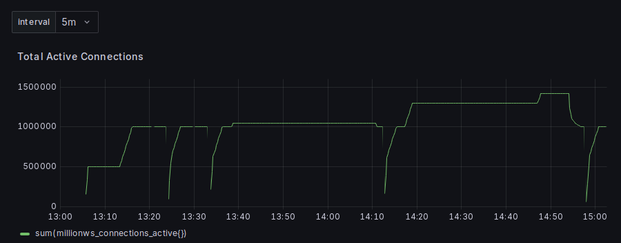
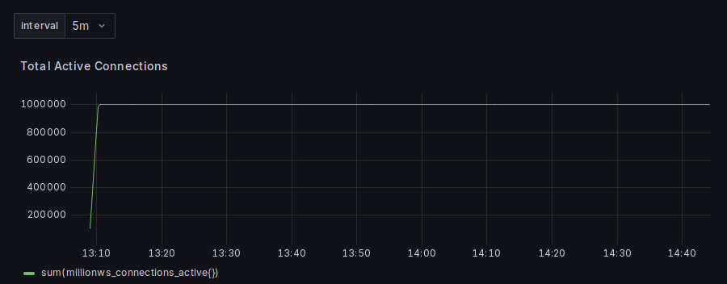

# MillionWS

MillionWS is a WebSocket echo server in Go, written to find out what it takes to hold 1,000,000 concurrent connections on one machine, and what each connection costs in memory, CPU, and file descriptors.

The server does as little as possible on purpose: it accepts connections, echoes messages, and exports metrics. There is no authentication, no persistence, and no application protocol. The interesting part is the measurement, the tuning, and the notes on what broke along the way.

## Status

The target of 1,000,000 concurrent connections has been reached and measured: one `m7i-flex.large` (2 vCPU, 8 GiB) held it in two AWS regions, for 75 minutes without anything touching it, and 1.42 million with a 7 GiB container. The limits found on the way are listed under [Results so far](#results-so-far).

**1,420,239 connections on one server** (Mumbai, 2026-09-30, times in IST). The steps are 500k, 1M, then 1.3M and 1.42M after the fixes; the dips around 1M are the server being killed on purpose in stall tests and every client reconnecting. The plateau at 1.42M is the server's memory guard turning further clients away, not a crash. [Full dashboard](results/aws/2026-09-30-mumbai-validation/evidence/screenshots/grafana_local-bench_full-run_1300-1503IST.png), [run report](results/aws/2026-09-30-mumbai-validation/README.md).



**1,000,008 connections held for 75 minutes** with nothing touching the server (Virginia, 2026-09-30, times in IST): 0 rejections, 0 crashes, memory flat. [Full dashboard](results/aws/2026-09-30-virginia-hold-75min/evidence/screenshots/grafana_local-bench_1306-1444IST.png), [run report](results/aws/2026-09-30-virginia-hold-75min/README.md).



| Stage | State |
| --- | --- |
| Echo server with Prometheus metrics | Done |
| Switch from gorilla/websocket to nbio (epoll) | Done, measured |
| Grafana dashboard, auto-provisioned | Done |
| Go load generator (`cmd/loadgen`) | Done |
| Local benchmark with the server capped at 1 CPU and 1 GiB | Done |
| EC2 stack (OpenTofu), tests | Done ([runbook](docs/aws-runbook.md)) |
| Cost guards (on-instance timer, watchdog Lambda) | Done; both terminated real instances ([test](results/aws/2026-09-30-cost-guard-test/README.md)) |
| AWS EC2 runs: 500k, 1M, a 75 minute hold, stalls, the limit above 1M | Done ([results](results/aws)) |

The plan, the open items, and the cost estimates are in [docs/roadmap.md](docs/roadmap.md). How to run and pay for the AWS test, and how it is kept from overspending: [docs/aws-runbook.md](docs/aws-runbook.md). A dated log of decisions and mistakes is in [docs/journey.md](docs/journey.md).

## Results so far

Local benchmark on 2026-09-28: the server in a Docker container limited to 1 CPU and 1 GiB with no swap, clients opening 1,000 connections per second until the server stops accepting, one 32-byte message per connection every 30 seconds. Medians of three runs per version:

| Server version | Peak connections | Memory per connection | Kernel part | Go part | After the peak |
| --- | --- | --- | --- | --- | --- |
| gorilla/websocket, goroutine per connection | 39,770 | 25.11 KiB | 4.00 KiB | 21.08 KiB | OOM-killed |
| nbio, first version | 193,532 | 5.31 KiB | 3.96 KiB | 1.35 KiB | OOM-killed |
| nbio, current | 190,894 | 4.91 KiB | 3.83 KiB | 1.08 KiB | still running, new clients get 503 |

The current version holds slightly fewer connections than the first nbio version but does not crash at its limit. Most of each connection's cost is now kernel memory for the TCP socket, which the Go code cannot reduce. Near the memory limit the GC uses the whole CPU core and echo p99 is about 93 ms.

EC2, 2026-09-30, one `m7i-flex.large` server (8 GiB, 2 vCPU), on-demand, three `c7i-flex.large` clients, idle connections with one 32-byte message per connection every 30 s. Every run below is in [results/aws](results/aws) with its evidence (Grafana screenshots and video, an asciinema recording, raw Prometheus data, kernel logs, CloudTrail and CloudWatch records):

| Run | Connections held | Result |
| --- | --- | --- |
| Canary, 1 client | 76,952 | stopped by the security group's connection tracking, not by the server ([report](results/aws/2026-09-30-canary/README.md)) |
| 1 client | 250,000 | tracking removed by an open security group with the filtering in a network ACL ([report](results/aws/2026-09-30-250k/README.md)) |
| Virginia | 999,999, then 999,996 for 18 min | first 1M runs; 999,999 is the server's own cap ([1](results/aws/2026-09-30-1m/README.md), [2](results/aws/2026-09-30-1m-repeat/README.md)) |
| Mumbai, first run | 999,996 | held 34 min at a stretch; killed 3 times by 30 s CPU profiles I ran on it ([report](results/aws/2026-09-30-mumbai-1m/README.md)) |
| **Virginia, 75 min hold** | **1,000,008** | **nothing touching the server for 75 min: 0 rejections, 0 kills, container memory flat at 5,172 MiB (+1 MiB in 55 min)** ([report](results/aws/2026-09-30-virginia-hold-75min/README.md)) |
| **Mumbai validation** | **1,300,002 held; 1,420,239 at the limit** | 500k and 1M stages, the stall tests, and the limit above 1M ([report](results/aws/2026-09-30-mumbai-validation/README.md)) |

What the numbers are, and what limits them:

- **Cost per connection:** 5.3 KiB all-in at 1M in a 6 GiB container: 3.84 KiB of kernel memory (the socket; constant in every run) plus 0.8 to 1.7 KiB of Go heap, which grows and shrinks with the container's limit. Echo p50 3 to 6 ms and p99 about 0.4 s at every size; the p99 is mostly the load generator (100 ms batches, 2 vCPU clients).
- **The kernel's connection-tracking table** (`nf_conntrack_max`, 1,048,576) stops a server that holds more than about 1.05M connections: new flows, including SSH and Prometheus, are dropped. The cloud-init now exempts the server ports; the 1M runs above were only 4.6% under the cap.
- **The container's memory** sets the ceiling: with a 7 GiB limit the memory guard (90%) turned clients away at 1,420,239 connections, and the server did not crash. That is a configuration limit on an 8 GiB machine, not a measured hardware maximum.
- **A stalled read path** kills the server. If the process stops reading for a few seconds, the clients' messages pile up in socket buffers at about 130 MiB per second, so the tolerance is roughly (container limit minus memory in use) divided by 130 MiB/s: about 8 seconds at 6 GiB and 13 seconds at 7 GiB. A 30 second CPU profile of the server killed it three times (`-pprof` is off by default for that reason). Recovery (Docker restart plus every client redialing) took 2 to 3 minutes each time.
- **What was not tested:** busy connections (an earlier local test found the server CPU-bound at about 40,000 connections sending 1 KiB per second each), holds longer than about 1.5 hours, other instance types and regions beyond these two.

Every step between these rows, the method, and its limits: [docs/local-benchmark.md](docs/local-benchmark.md), [docs/journey.md](docs/journey.md), and the raw data in [results/local](results/local).

## How it works

| Part | Technology |
| --- | --- |
| Language | Go 1.25 |
| WebSocket | [nbio](https://github.com/lesismal/nbio) v1.6.8, event loop on epoll |
| Metrics | Prometheus client, scraped every 5 s |
| Dashboards | Grafana, provisioned from `deploy/grafana/provisioning` |
| Load testing | `cmd/loadgen` (Go, nbio) |
| Infrastructure | OpenTofu for AWS EC2 |

With gorilla/websocket each connection needs a goroutine blocked on read, so 1M connections means 1M goroutines and their stacks. nbio registers every socket with epoll and runs callbacks from a small pool of goroutines, so the goroutine count stays flat as connections grow.

When the server runs under a cgroup v2 memory limit, it manages memory itself (`memory.go`):

- Once a second it sets the Go soft memory limit to 88% of the cgroup limit minus the memory the kernel holds for sockets. The kernel's share grows with every connection, so a fixed `GOMEMLIMIT` would be wrong at most connection counts. Setting `GOMEMLIMIT` turns this off.
- Above 90% of the cgroup limit, `/ws` answers 503 until usage falls below 85%. This keeps the process out of the OOM killer, which would close every connection at once.

The listener uses `tcp4` when `-addr` is an IPv4 address. A dual-stack `[::]` listener turns every IPv4 client into an IPv6 socket, which uses more kernel memory.

### Endpoints

| Path | Description |
| --- | --- |
| `/ws` | WebSocket endpoint; echoes every message back |
| `/health` | Returns `200 OK` |
| `/metrics` | Prometheus metrics |

The server listens on `0.0.0.0:8080` by default. Use `-addr` and `-port` to change it, and `-pprof` to serve `/debug/pprof/` on the same port (a 30 second CPU profile at 1M connections stalls the server long enough to get it OOM-killed; see [docs/aws-runbook.md](docs/aws-runbook.md)). `-maxload` sets the maximum number of open connections (default 1,000,000): nbio refuses more, **including `/metrics` and `/health` requests**, which use the same ports, so keep it above the number of connections you plan to hold.

### Metrics

| Metric | Type |
| --- | --- |
| `millionws_connections_total` | Counter of accepted connections |
| `millionws_connections_active` | Gauge of open connections |
| `millionws_disconnections_total` | Counter of closed connections |
| `millionws_upgrade_errors_total` | Counter of failed WebSocket handshakes |
| `millionws_connections_rejected_total` | Counter of 503 answers from the memory guard |
| `millionws_go_memory_limit_bytes` | Gauge of the Go memory limit the server set |

Process memory, goroutine count, and open file descriptors come from the default Go and process collectors.

## Quickstart

Local, with [just](https://github.com/casey/just) and Docker:

```sh
just run                # build and start the server on :8080
just start-monitoring   # Prometheus on :9090, Grafana on :8001
```

Local benchmark, the server capped at 1 CPU and 1 GiB (needs Docker and Python 3; see [docs/local-benchmark.md](docs/local-benchmark.md)):

```sh
just bench nbio-tuned   # one run of one version, results in results/local/
just bench-matrix 3     # every version 3 times, plus a comparison table
```

On AWS EC2 (one server and N clients on Spot or on-demand; default instance types work on the AWS free plan, see [docs/aws-runbook.md](docs/aws-runbook.md)):

```sh
cd infra/opentofu/aws-ec2
tofu apply -var my_ip=<ip>/32 -var key_name=<key pair> -var git_ref=<pushed branch or SHA>
tofu destroy ...        # same variables; every session ends here
scripts/kill-bench.sh   # emergency: terminate every tagged instance now
```

Instances terminate themselves after 4 hours and a watchdog Lambda terminates any that outlive that, so a forgotten stack cannot bill for long.

## Repository layout

| Path | Contents |
| --- | --- |
| `main.go`, `memory.go` | The server |
| `cmd/loadgen` | Load generator: holds N connections and measures echo latency |
| `bench/local` | Local benchmark: Compose file, run and recording scripts, one file per server version |
| `results/local` | Benchmark output, one directory per run |
| `deploy/local` | Docker Compose for local Prometheus and Grafana |
| `deploy/aws` | Docker Compose for the server side of the EC2 stack |
| `deploy/grafana` | Grafana datasource and dashboard provisioning |
| `infra/opentofu/aws-ec2` | OpenTofu for the EC2 load-test stack (server + clients) and the cost watchdog Lambda (`watchdog.tf`, `guard/`) |
| `scripts` | `kill-bench.sh`, the emergency terminate |
| `docs` | Roadmap, journey, benchmark method, and the AWS runbook |

Earlier approaches were removed once the EC2 stack replaced them: two EKS clusters with a Locust load generator, and a single Hetzner Cloud server. The last commit that has them is `d6c12c0` (`git show d6c12c0:infra/opentofu/hetzner/main.tf`); the reasons are in [docs/journey.md](docs/journey.md).

## References

- https://www.freecodecamp.org/news/million-websockets-and-go-cc58418460bb/
- https://dyte.io/blog/scaling-websockets-to-millions/
- https://github.com/gobwas/ws-examples/blob/master/src/chat/main.go#L135
- https://blog.ukena.de/posts/2021/11/provisioning-grafana-dashboards-in-docker/

## License

MIT, see [LICENSE](LICENSE).
