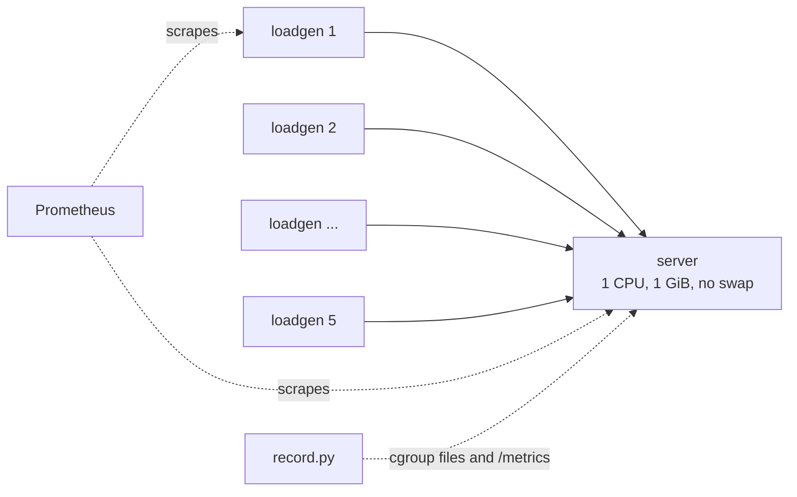

# Local benchmark

The local benchmark answers one question for each version of the server: how many idle WebSocket connections fit in a container with 1 CPU and 1 GiB of memory, and what does each one cost. It runs on one machine with Docker Compose and needs no cloud account.

## Setup



- The server container is limited with `cpus: 1`, `mem_limit: 1g`, and `memswap_limit: 1g`, so it cannot swap. Its file descriptor limit is 1,048,576, and `somaxconn` is raised to 65,535 inside its network namespace.
- Five load generator containers (`cmd/loadgen`) share the target between them. Each has its own IP address and a local port range of 1024 to 65535, so each can open about 64,000 connections to `server:8080`; five of them can open about 320,000.
- The load generators are not limited, so they are not the bottleneck. They run on the same host, so they compete with the server for host CPU.
- Every connection sends a 32-byte text message every 30 seconds and waits for the echo. The connections are mostly idle, which is the case this project studies.

## What is measured

`bench/local/record.py` takes a sample every 2 seconds from two places:

| Source | Values |
| --- | --- |
| The server container's cgroup (`memory.current`, `memory.stat`, `cpu.stat`) | Total memory charged to the container, split into anonymous memory (the Go process), kernel slab memory, and socket buffers; CPU time |
| The server's `/metrics` endpoint, read directly | Active connections, goroutines, open file descriptors, Go heap, process RSS |
| Prometheus | Load generator totals: connections, dial errors, echo latency percentiles |

The cgroup number is the one that decides when the kernel OOM-kills the container. It includes kernel memory for each socket, which the process RSS does not show: at 190,000 connections the kernel held about 715 MiB and the Go process about 210 MiB.

Memory per connection is `(value at peak - value when idle) / connections at peak`.

The server's metrics are read directly rather than from Prometheus because Prometheus keeps returning the last scraped value for a few seconds after the server dies. The first version of the recorder paired those stale connection counts with an empty cgroup and reported the wrong peak.

## When a run stops

A run stops at the first of:

- the server container exits (for example OOM-killed, exit code 137);
- the connection count has not grown by more than 0.5% for 90 seconds;
- the target is reached and held for 60 seconds;
- 30 minutes have passed.

The load generators keep dialing until the target is reached, so the dial errors at the end show what refused the connections: `handshake` for the server's 503 answer, `refused` or `reset` after the server died, `timeout` for dropped SYNs.

## Variants

Each file in `bench/local/variants/` names a git commit of the server. `run.sh` builds that commit with its own Dockerfile (`git archive <ref> | docker build -`), so older versions are measured with the current harness and the same limits.

| Variant | Commit | Server change |
| --- | --- | --- |
| `gorilla` | `99609ad` | gorilla/websocket, one goroutine per connection, logs every message |
| `nbio-initial` | `27b4027` | nbio event loop, as first written |
| `nbio-fixes` | `1b82b39` | no panic on failed upgrade, no log line per disconnect |
| `nbio-ipv4` | `4e46794` | IPv4 listener instead of dual-stack `[::]` |
| `nbio-memlimit` | `9a1d737` | Go memory limit follows the cgroup limit minus kernel memory |
| `nbio-guard` | `dadb29f` | 503 for new connections above 90% of the memory limit |
| `nbio-tuned` | `476f773` | Go memory limit set 2 points under the guard |
| `nbio-nokeepalive` | `bb8dfdb` | `-keepalive=0s`: no per-connection read-deadline timers |
| `nbio-pollers1` | `bb8dfdb` | `-pollers=1` instead of the default (`NumCPU/4`) |
| `nbio-gogc50` / `nbio-gogc200` | `476f773` | `GOGC=50` / `GOGC=200` via container env |
| `nbio-profile` | `bb8dfdb` | tuned behavior plus `-pprof`, for heap/CPU profiles at peak |
| `nbio-gogc50` / `nbio-gogc200` | `476f773` | tuned code with `GOGC=50` / `GOGC=200` |
| `nbio-2ports` | `99d9237` | `-ports=8081` second listener; 1 loadgen × 2 ports held 100k with zero dial errors, proving the ~64k-per-(client IP, server port) ceiling is gone |

Environment overrides change the limits without a new variant: `SERVER_CPUS`,
`SERVER_MEM`, `LOADGEN_RATE` (per replica, default 1,000/replicas total),
`LOADGEN_INTERVAL`, `LOADGEN_PAYLOAD`, `HOLD`, `PLATEAU`, `MAX`, `KEEP`.
The optimization night (results in
[2026-09-29-optimization.md](../results/local/2026-09-29-optimization.md))
used these to sweep CPUs (1/2/4), memory (512m/1g), dial rate (5,000/s
burst), active traffic (1 KiB every 1 s), and a 600 s soak.

## Running it

Requirements: Docker with Compose, Python 3, and about 3 GiB of free memory (1 GiB for the server, the rest for the load generators).

```sh
bench/local/run.sh nbio-tuned              # one run, 300,000 target, 5 load generators
bench/local/run.sh gorilla 50000 1         # smaller target, 1 load generator
bench/local/matrix.sh 3                    # every variant 3 times, then a comparison table
KEEP=1 bench/local/run.sh nbio-fixes       # leave the stack running, e.g. to take a heap profile
```

Each run writes `results/local/<date>-<variant>/`:

| File | Contents |
| --- | --- |
| `environment.md` | Host, kernel, Docker, limits, load settings, server commit |
| `idle.json` | Sample before any client connects |
| `samples.csv` | Every sample during the run |
| `summary.md`, `summary.json` | Peak, memory per connection, stop reason, dial errors |
| `server.log`, `loadgen.log` | Last lines of each log |
| `evidence/` | Screenshots for the report, when the run was kept for evidence (see below) |

## Grafana and evidence screenshots

`KEEP=1` leaves the stack running and serves Prometheus on `127.0.0.1:19090`. Grafana is behind the `grafana` Compose profile because `run.sh` does not start it on its own; bring it up next to a running stack (it needs the same `SERVER_IMAGE` only for Compose interpolation):

```sh
KEEP=1 bench/local/run.sh nbio-tuned 300000 5   # full peak run, stack stays up
SERVER_IMAGE=millionws-bench:nbio-tuned \
  docker compose --profile grafana up -d grafana   # run from bench/local
```

Grafana is then on `127.0.0.1:18001` with anonymous admin access. Two dashboards are provisioned under the MillionWS folder:

| Dashboard | UID | Use |
| --- | --- | --- |
| `MillionWS` | `ypFZFgvmz` | Kubernetes deployment (filters on `namespace`/`pod` labels) |
| `MillionWS local bench` | `millionws-local` | Local benchmark: same panels with the pod filter removed, pinned to `{namespace="millionws"}` |

Only the local one shows data for bench runs, because the local Prometheus (`bench/local/prometheus.yml`) labels the server job with `namespace="millionws"` but sets no `pod` label, so every panel of the k8s dashboard matches nothing.

Screenshots were taken headless with Playwright against the live stack (no desktop browser needed):

- Grafana: `http://127.0.0.1:18001/d/millionws-local/millionws-local-bench?orgId=1&from=now-1h&to=now`, scrolled top to bottom first so lazily rendered panels load, then a full-page capture.
- Prometheus console (v3): preselect the query through URL parameters, e.g. `/query?g0.expr=sum(millionws_connections_active)&g0.tab=1&g0.range_input=1h`. Typing into the CodeMirror box trips its autocomplete; the `g0.*` parameters avoid that. Omit empty parameters — an empty `g0.end_input=` makes the page fail with "Invalid time value".

### Evidence run: `results/local/2026-09-28-nbio-tuned-4`

Re-ran `nbio-tuned` at the full 300,000 target with 5 load generators to attach dashboard evidence to the report. It reproduced the comparison medians: **190,764 connections at 4.9 KiB each, no OOM** (`running false 0`, stopped on the 90 s plateau), with 87,190 dial errors — all `handshake`, i.e. the 503 admission guard turning new clients away while existing connections stayed up.

| File in `evidence/` | Shows |
| --- | --- |
| `grafana-dashboard.png` | Local bench dashboard: connections ramp to ~190k and hold, process memory, Go memstats |
| `prometheus-connections.png` | Console table: `sum(millionws_connections_active)` = 190764 |
| `prometheus-connections-graph.png` | Console graph: linear ramp, then the flat guarded plateau |
| `prometheus-targets.png` | Scrape health: 5/5 loadgen targets UP, 1/1 server UP |

## Limits of this setup

- The load generators and the server share one host. Echo latency includes time spent waiting for host CPU, so it is only comparable between runs on the same machine.
- On this machine Docker runs rootless. Container-to-container traffic goes through the conntrack table of Docker's network namespace, which allows 262,144 entries. No run came close to it, but a server with more memory would reach it before 300,000 connections.
- One CPU core is shared by the Go runtime, the GC, and nbio's event loops. When the memory limit binds, the GC uses a large share of it, which shows up as higher CPU and echo latency.
