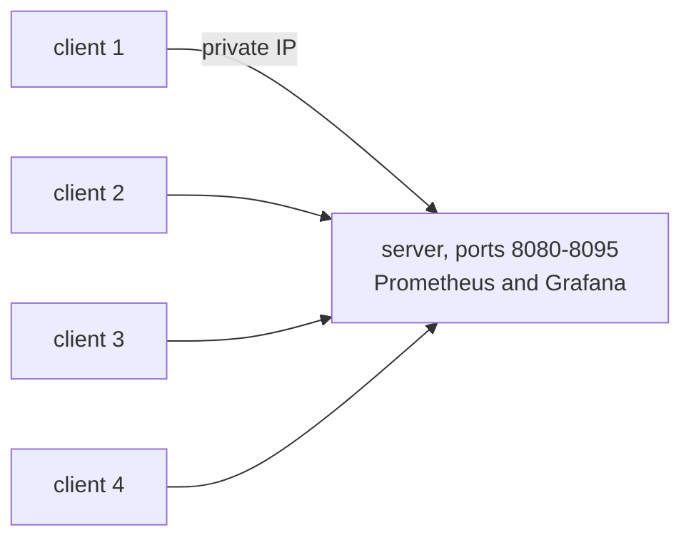

# Roadmap

The plan for getting from the current state to a measured 1,000,000-connection run. Costs here are estimates and are marked as such; measured costs will go into the results for each run.

## Target setup

All machines are EC2 instances in one availability zone. Traffic stays on private IPs, so there is no NAT gateway, no load balancer, and no data transfer charge between instances in the same zone.

Each (client IP, server port) pair can hold about 64,000 connections. Four clients and 16 server ports allow about 4,000,000, which leaves room above the target of 1,000,000 without needing 16 client machines.

## Phases

### 0. AWS account

- Upgrade the account from the free plan to the paid plan so EC2 instances of this size can be launched. The $200 credit stays.
- Request vCPU quotas of 32 for on-demand and 32 for Spot standard instances.
- Budget alerts at $10, $25, $50, and $100.
- A separate IAM identity for Terraform, and one region for everything.

### 1. Code

- Server listens on 16 ports.
- Failed upgrades are logged instead of calling `panic`.
- Remove the per-disconnect `fmt.Println`.
- New Go load generator in `cmd/loadgen`, using nbio. It opens connections at a set rate, keeps them mostly idle, sends a message on a set interval, and exports its own metrics (connected, failed, echo latency).
- `ulimits` of 1,048,576 on the server container, and `fs.nr_open` raised with the other sysctls.
- Prometheus scrapes the load generators as well as the server.
- CI: `go vet`, `go test`, `terraform fmt -check`, `terraform validate`.

### 2. Local run

On a workstation with 12 cores and 40 GB of RAM. Loopback accepts any address in `127.0.0.0/8` as a source IP, which removes the 64,000 limit without extra machines. Expected ceiling is 300,000 to 500,000 connections (estimate, limited by memory for both server and clients on one machine). This run gives the first nbio number for memory per connection.

### 3. Terraform for EC2

`infra/terraform/aws-ec2`: one VPC, one public subnet, a security group that allows SSH and Grafana only from my IP and all traffic between the instances, one server and N clients. Spot by default with a flag for on-demand. The cloud-init script from the Hetzner setup is reused.

### 4. AWS runs

| Run | Connections | Clients | Time budget |
| --- | --- | --- | --- |
| 1 | 100,000 | 1 | 1 h |
| 2 | 250,000 | 2 | 1.5 h |
| 3 | 500,000 | 4 | 2 h |
| 4 | 1,000,000 | 4 | 2 to 3 h, possibly two attempts |

Every run records instance types, region, kernel version, Go version, commit SHA, and the exact command. Memory per connection is reported as (RSS at N connections minus RSS with none) divided by N, with kernel socket memory reported separately. Results go in `results/<date>-<connections>/` with Grafana screenshots and the raw numbers.

### 5. Write-up

A results table in the README comparing gorilla/websocket, nbio locally, and nbio on EC2, with the measured cost of each run.

## Open items

Blocking the 1M run:

- No load generator on the Hetzner stack.
- The Locust client cannot hold 1M connections (see [journey.md](journey.md), September 2026).
- Only one server port, so one client IP is limited to about 64,000 connections.
- File descriptor limit is 200,000 on the host and not set on the container.
- The Hetzner Terraform uses `cx23` (2 vCPU); a 1M run needs a larger instance.
- `locustfile.py` defaults to `ws://localhost:4001`, while the server listens on 8080 (8002 on the Hetzner host).

Correctness:

- `onWebsocket` calls `panic` when an upgrade fails.
- `OnClose` prints one line per disconnect.
- `deploy/millionws/deployment.yaml` limits each pod to 512 MiB and scales on CPU, which does not track idle connections.

Security, since the Hetzner server has a public IP:

- Grafana with `admin/admin`, Prometheus with `--web.enable-lifecycle`, and the image renderer are reachable from the internet. Needs a firewall rule or an SSH tunnel.

## Cost estimates

These are estimates from listed prices checked in September 2026, not measured bills.

EC2 in us-east-1, per hour:

| Item | On-demand | Spot |
| --- | --- | --- |
| Server, m6a.2xlarge (8 vCPU, 32 GB) | about $0.35 | about $0.12 |
| 4 clients, m6a.xlarge | about $0.70 | about $0.25 |
| Public IPv4 addresses and EBS | about $0.03 | about $0.03 |
| Total | about $1.10 | about $0.40 |

About 15 hours of AWS time across all runs comes to $6 to $17, inside the $200 credit. The larger risk is leaving the instances running: the full on-demand setup costs about $800 per month. Every session ends with `terraform destroy`.

For comparison, the same setup on Hetzner (one CCX33 at €0.2227 per hour and 16 CPX51 clients at €0.3822 per hour) comes to about €6.30 per hour, and two EKS clusters under load to about $5 to $10 per hour.
