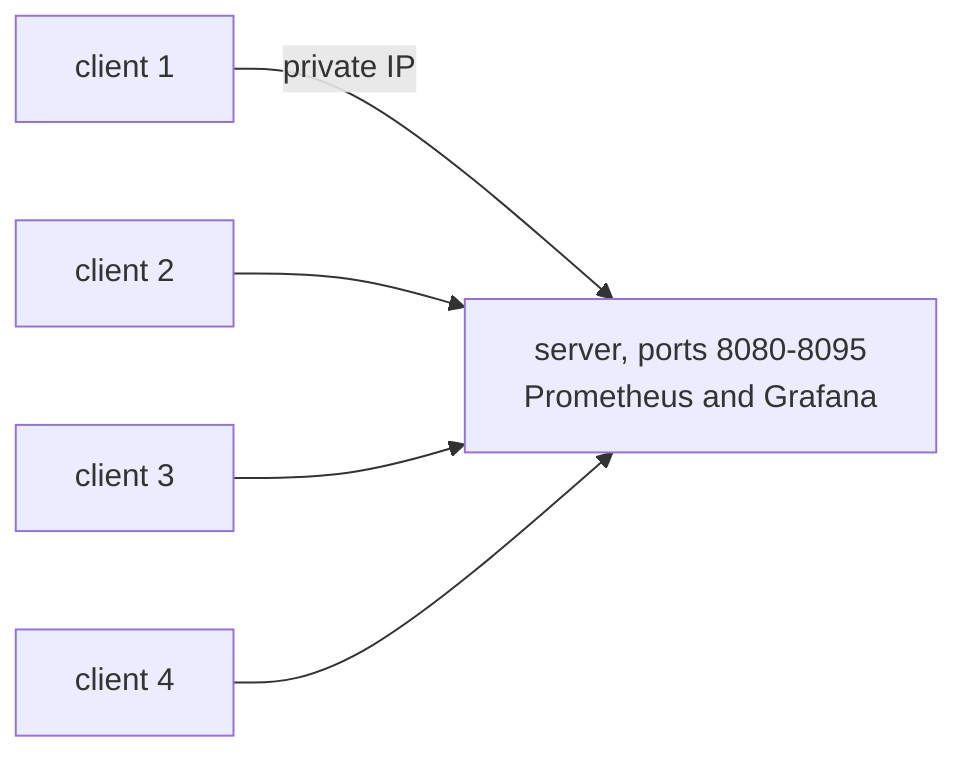

# Roadmap

The plan for getting from the current state to a measured 1,000,000-connection run. Costs here are estimates and are marked as such; measured costs will go into the results for each run.

## Target setup

All machines are EC2 instances in one availability zone. Traffic stays on private IPs, so there is no NAT gateway, no load balancer, and no data transfer charge between instances in the same zone.

Each (client IP, server port) pair can hold about 64,000 connections. Four clients and 16 server ports allow about 4,000,000, which leaves room above the target of 1,000,000 without needing 16 client machines.

## Phases

### 0. AWS account

- Upgrade the account from the free plan to the paid plan so EC2 instances of this size can be launched. The $200 credit stays.
- Request vCPU quotas of 32 for on-demand and 32 for Spot standard instances.
- Budget alerts at $10, $25, $50, and $100.
- A separate IAM identity for Terraform, and one region for everything.

### 1. Code

Done:

- Failed upgrades are counted in a metric instead of calling `panic` (`1b82b39`).
- The per-disconnect log line is gone (`1b82b39`).
- Go load generator in `cmd/loadgen`, on nbio. It opens connections at a set rate, keeps them mostly idle, sends a message on a set interval, and exports connected, failed by reason, and echo latency.
- The local benchmark sets `ulimits` of 1,048,576 on the server container and scrapes the load generators.
- Memory management for containers: the Go memory limit follows the cgroup limit, and new connections get a 503 above 90% of it (`476f773`).

Still to do:

- Nothing on the code side; all three done 2026-09-29 (see Done below).

Done, 2026-09-29:

- Server listens on N ports: `-ports=8081,8090-8095` fans out to nbio
  `Addrs` (`99d9237`), `-port` unchanged for the single-port case. Proven
  locally: 1 loadgen × 2 ports held 100k with zero dial errors
  (`results/local/2026-09-29-nbio-2ports/`), past the ~64k-per-pair ceiling.
- fd limits raised everywhere: Hetzner host `nofile` 200k → 2M,
  `file-max` → 3M, `fs.nr_open` = 2M, `nf_conntrack_max` = 1M, container
  `ulimits` 2M, 16 ports published; same block in the EC2 cloud-init.
- CI (`.github/workflows/ci.yml`): `gofmt` clean, `go vet`, `go test`,
  `go build`, plus `tofu fmt -check`, `init`, `validate` for
  `hetzner` and `aws-ec2`.

### 2. Local run

Done on 2026-09-28, with the server capped at 1 CPU and 1 GiB rather than using the whole workstation. The cap makes the limit reproducible and turns the result into a per-connection cost. Method in [local-benchmark.md](local-benchmark.md), results in [results/local/2026-09-28-comparison.md](../results/local/2026-09-28-comparison.md).

The final version held 190,894 connections at 4.91 KiB each. 3.83 KiB of that is kernel memory for the socket, which no change to the Go code can remove.

What this means for 1,000,000 connections, as an estimate from the per-connection cost: 1,000,000 × 4.91 KiB is about 4.7 GiB, and with the admission guard at 90% the server needs a memory limit of about 5.2 GiB. The earlier plan of an 8 vCPU, 32 GiB server has more memory than that needs. The CPU need is less clear: near the memory limit the GC used a full core.

### 3. Terraform for EC2

Done 2026-09-29 in `infra/opentofu/aws-ec2` (fmt + init + validate green,
both cloud-init scripts `bash -n` clean and template-render tested): one VPC,
one public subnet in a single AZ, a security group that allows SSH, Grafana
and Prometheus only from `my_ip` with all traffic between the instances, one
server and N clients. Spot by default with a `use_spot` flag for on-demand.
The cloud-init reuses the Hetzner tuning block (adapted to AL2023/`dnf`,
`ec2-user`), with the 2M fd limits and 1M conntrack from the start.

Two design points worth knowing: server and clients discover each other
through the EC2 API (tagged instances + an IAM describe role), so there are
no Terraform cross-references and no dependency cycle — one `apply` brings
everything up, clients wait up to 20 minutes for the server and vice versa.
And the server's Prometheus targets (each client's `9101..910N` loadgen
metrics ports) are rendered into `deploy/aws/prometheus.yml` by cloud-init
before compose starts. Grafana reuses the repo provisioning, including the
local-bench dashboard (the EC2 scrape config sets the same
`namespace="millionws"` label it filters on).

### 4. AWS runs

| Run | Connections | Clients | Time budget |
| --- | --- | --- | --- |
| 1 | 100,000 | 1 | 1 h |
| 2 | 250,000 | 2 | 1.5 h |
| 3 | 500,000 | 4 | 2 h |
| 4 | 1,000,000 | 4 | 2 to 3 h, possibly two attempts |

Every run records instance types, region, kernel version, Go version, commit SHA, and the exact command. Memory per connection is reported as (RSS at N connections minus RSS with none) divided by N, with kernel socket memory reported separately. Results go in `results/<date>-<connections>/` with Grafana screenshots and the raw numbers.

### 5. Write-up

A results table in the README comparing gorilla/websocket, nbio locally, and nbio on EC2, with the measured cost of each run.

## First apply attempt, 2026-09-30

The first `tofu apply` on EC2 (1 server, 3 clients, 100k target) launched nothing: all four Spot requests were cancelled with `InvalidParameterCombination: instance type is not eligible for Free Tier`, because the account was still on the free plan (phase 0). Both vCPU quotas are 8; a 100k run fits exactly, the 1M setup (4 + 4 x 2 = 12 vCPU) does not.

A review of the stack before the retry found and fixed:

- `deploy/aws/compose.yml` passed `-ports=8080-8095` with the default `-port=8080`. 8080 was listed twice, the second bind failed, and the server stayed up listening on no port at all. The server now drops repeated ports, and exits if any listener is not accepting connections after start.
- Cloud-init cloned the default branch (`main`), which has no `deploy/aws` or `cmd/loadgen`. A required `git_ref` variable is now checked out, and the resolved SHA is written to `~/GIT_SHA`.
- Tags on `aws_spot_instance_request` do not reach the launched instance, so discovery by `tag:Name` would never have found a peer. Server and clients are now `aws_instance` with `instance_market_options` (Spot, `one-time`).
- `go test` had no tests. `main_test.go` covers port parsing, the duplicate-port case, the listening check, the cgroup reader, and an end-to-end echo on two ports plus the 503 guard.
- `nf_conntrack` is loaded before `sysctl` so `nf_conntrack_max` applies; `conns_per_client / client_replicas` is floored.

Not done, worth checking on the first real run: Docker NAT and conntrack on the load path (`--network host` for loadgen and server), and the ENA `conntrack_allowance_exceeded` counter, since the security group's self-referencing rule is tracked.

## Open items

Blocking the 1M run:

- The Hetzner stack has no load generator. `cmd/loadgen` can fill that role now.
- The Locust client cannot hold 1M connections (see [journey.md](journey.md), September 2026). `cmd/loadgen` replaces it for connection-count tests.
- Only one server port, so one client IP is limited to about 64,000 connections.
- File descriptor limit is 200,000 on the Hetzner host and not set on its container.
- The Hetzner Terraform uses `cx23` (2 vCPU, 4 GB); a 1M run needs about 5.2 GiB for the server alone (estimate above).
- `locustfile.py` defaults to `ws://localhost:4001`, while the server listens on 8080 (8002 on the Hetzner host).

Server:

- Near the memory limit the GC uses a full core and echo p99 rises to about 100 ms. Each connection has its own read-deadline timer and stores its local and remote address; in the heap profile at 120,000 connections these were about 20 MB and 22.5 MB. A shared idle sweep instead of per-connection timers could save part of the 1.08 KiB of Go memory per connection. Not measured yet.
- `deploy/millionws/deployment.yaml` limits each pod to 512 MiB and scales on CPU, which does not track idle connections.

Security, since the Hetzner server has a public IP:

- Grafana with `admin/admin`, Prometheus with `--web.enable-lifecycle`, and the image renderer are reachable from the internet. Needs a firewall rule or an SSH tunnel.

## Cost estimates

These are estimates from listed prices checked in September 2026, not measured bills.

EC2 in us-east-1, per hour:

| Item | On-demand | Spot |
| --- | --- | --- |
| Server, m6a.2xlarge (8 vCPU, 32 GB) | about $0.35 | about $0.12 |
| 4 clients, m6a.xlarge | about $0.70 | about $0.25 |
| Public IPv4 addresses and EBS | about $0.03 | about $0.03 |
| Total | about $1.10 | about $0.40 |

About 15 hours of AWS time across all runs comes to $6 to $17, inside the $200 credit. The larger risk is leaving the instances running: the full on-demand setup costs about $800 per month. Every session ends with `tofu destroy`.

For comparison, the same setup on Hetzner (one CCX33 at €0.2227 per hour and 16 CPX51 clients at €0.3822 per hour) comes to about €6.30 per hour, and two EKS clusters under load to about $5 to $10 per hour.
