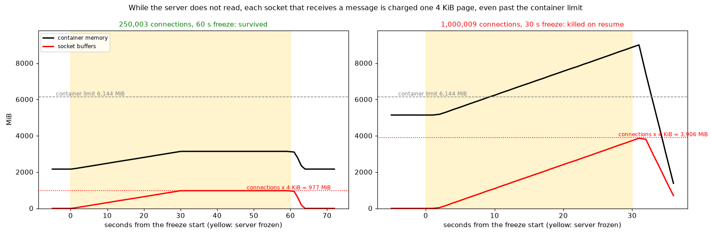

# Why a stalled server loses every connection, and what does not fix it (all times IST)

The question: at 1M connections, a server that stops reading for about 9 seconds is OOM-killed and every connection drops. Could a kernel TCP setting stop that? This run tested a per-socket cap (`tcp_rmem`) and a global cap (`tcp_mem`), and then measured how far the memory grows when nothing stops it.

**Short answer:** neither setting helps. The memory is one 4 KiB page per socket that receives a message while the server is not reading, charged to the server's container **even past its limit**, and the process is killed the moment it resumes. The growth stops by itself once every socket holds one page (after one message interval, 30 s here), at **connections × 4 KiB**: 3.9 GiB at 1M. The fix is headroom of that size, or fewer connections per container; a kernel buffer setting cannot do it.

Evidence: [evidence/](evidence/). Chart: [socket_memory_bound.png](evidence/charts/socket_memory_bound.png).

## Setup

| | |
| --- | --- |
| Region, time | `ap-south-1`, 16:37 to 17:16 IST, 2026-09-30 |
| Commit | `2191c5690d235a9833740723f4947e3ddbd8f64c` (`main`, with the conntrack exemption in cloud-init; no `table full` in the kernel log this time) |
| Server | `m7i-flex.large`, container limit 6 GiB, `-maxload=1100000`; kernel 6.12.110-135.201.amzn2023 |
| Clients | 3 x `c7i-flex.large`, 1,000,008 connections (3 x 333,336), one 32-byte message per connection every 30 s (33,333 per second) |
| Freeze | `scripts/evidence/stall.sh`: `SIGSTOP` on the server process for N seconds, then `SIGCONT` |
| Measured | `memwatch.sh` at 1 Hz (container memory, anon, kernel, socket memory, established sockets), `sysctl`, `/proc/net/sockstat` and `nstat` before and after each freeze |
| Cost | about $0.25 (39 minutes of the fleet, list prices) |

## Results

| Test | Setting | Connections | Freeze | Socket memory growth | Result |
| --- | --- | --- | --- | --- | --- |
| 1 | defaults: `tcp_rmem 4096 131072 6291456`, `tcp_mem 91830 122441 183660` (max 717 MiB) | 1,000,009 | 9 s | 112 MiB/s | **killed** |
| 2 | `tcp_rmem 4096 4096 4096` (server restarted, so every socket has it; checked: `rb4096`) | 1,000,009 | 9 s | 112 MiB/s | **killed** |
| 2 | same | 1,000,009 | 20 s | 124 MiB/s | **killed** |
| 2 | same | 1,000,009 | 30 s | 118 MiB/s | **killed** |
| 3 | `tcp_mem 16384 24576 32768` (max 128 MiB) | 1,000,009 | 9 s | 132 MiB/s | **killed** |
| 4 | defaults | 250,003 | 60 s | 32.6 MiB/s for 30 s, then **0** | **survived**; plateau 976 MiB |

Growth rates are the slope of socket memory over the first seconds of each freeze, from the 1 Hz traces in [evidence/memwatch](evidence/memwatch/). Per message that is 3.4 to 4.1 KiB: one page.

## What the data shows

**1. One page per socket, and it is bounded.** In test 4, socket memory rose linearly for exactly 30 seconds and then stayed flat at 976 MiB until the freeze ended at 60 s: 250,004 connections × 4 KiB = 976.6 MiB. Between 30 and 60 s every socket received its second message, and the memory did not move: the second message fits in the page already charged. At 1M the same growth reached 3,864 MiB at 31 s, against a bound of 3,906 MiB.

**2. The container is charged past its limit, and the kill comes on resume.** In the 30 s freeze at 1M the container reached **9,006 MiB with a limit of 6,144 MiB**, and the process was not killed while it was frozen. The kernel charges incoming network data to the container even above its limit. The OOM kill happened right after each freeze ended (9 s freeze: 16:44:28 to the kill at 16:44:38; 20 s: 16:56:18 to 16:56:39; 30 s: 17:00:34 to 17:01:05), which fits the process's first memory allocation after resuming failing because the container is already over its limit. The memory guard in the server cannot help: it only refuses new connections.

**3. `tcp_rmem` cannot bound one page.** With every socket's receive buffer at 4,096 bytes (confirmed on the sockets: `rb4096`), growth was the same. A socket holding a single message is already at its cap, and the kernel does not drop that message; during the 9 s freeze it tried to prune receive queues 227,141 times but compacted nothing (`TCPRcvCollapsed` 0), because there is nothing to merge in a one-message queue.

**4. `tcp_mem` does not count this memory, and does harm.** The kernel's global TCP counter (`sockstat` `mem`) read 131 to 919 pages while the container held over a GiB of socket memory, so the container's sockets are outside the global limit on this kernel, and a 128 MiB cap made no difference. It did abort 20,975 connections for lack of memory (`TCPAbortOnMemory`) while clients reconnected. Do not use it.

## What this means for sizing

To survive a stall of any length (tested to 60 s), a container needs **connections × 4 KiB** free above its normal usage:

| Container limit | Normal usage per connection (measured 5.0 to 5.3 KiB at 1M) | Plus 4 KiB | Connections that survive any stall (estimate) |
| --- | --- | --- | --- |
| 6 GiB | about 5.2 KiB | 9.2 KiB | about 680,000 |
| 7 GiB | about 5.2 KiB | 9.2 KiB | about 800,000 |
| about 9 GiB | about 5.2 KiB | 9.2 KiB | 1,000,000 (needs a larger instance than 8 GiB) |

These are estimates from the measured costs, not tested: the Go heap part flexes with the container limit. At 250,003 connections the server used 2,164 MiB, so 250k survives any stall with room to spare, which test 4 showed.

A server-side fix follows from this: the memory guard could count the worst case, refusing new connections once `memory.current + connections × 4 KiB` passes its threshold. That trades capacity (about 680k per 6 GiB instead of 1M) for surviving any stall. Not implemented.

## Not tested

- Freezes longer than 60 s (more than two messages per socket); the page per socket fits several 32-byte messages, but not unlimited ones.
- A real stall (a busy or blocked read path) instead of `SIGSTOP`; in a real stall the process keeps allocating, so it may be killed as soon as the container reaches its limit instead of on resume.
- Other kernels, instance types, network drivers, or larger messages.
- `tcp_rmem` in the other direction (on the clients) and `memory.high`.

## Mistakes

- My script's "stop after the first kill" check never matched (its output included log lines), so test 2 ran all three freezes; the extra kills are in the results. I stopped test 3 by hand after its first kill.
- Earlier reports said the 7 GiB server was killed "one second before its 14 second freeze would have ended". That was wrong: the kill comes when the process resumes. The Mumbai validation report and the journey are corrected.
